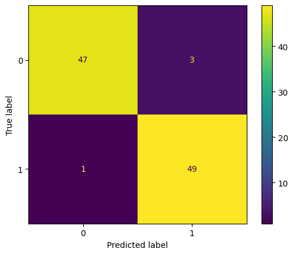

# tutorial_tensorflow
bunch of tensor flow tutorials

```
pip freeze > requirements.txt
conda create -n tflow
conda activate tflow
pip install -r requirements.txt
```
To install [TensorFlow](https://www.tensorflow.org/install/pip) with pip, if the requirements.txt doesn't work.

```
conda install -c conda-forge cudatoolkit=11.8.0
python3 -m pip install nvidia-cudnn-cu11==8.6.0.163 tensorflow==2.12.*
mkdir -p $CONDA_PREFIX/etc/conda/activate.d
echo 'CUDNN_PATH=$(dirname $(python -c "import nvidia.cudnn;print(nvidia.cudnn.__file__)"))' >> $CONDA_PREFIX/etc/conda/activate.d/env_vars.sh
echo 'export LD_LIBRARY_PATH=$LD_LIBRARY_PATH:$CONDA_PREFIX/lib/:$CUDNN_PATH/lib' >> $CONDA_PREFIX/etc/conda/activate.d/env_vars.sh
source $CONDA_PREFIX/etc/conda/activate.d/env_vars.sh
# Verify install:
python3 -c "import tensorflow as tf; print(tf.config.list_physical_devices('GPU'))"
```

```
conda clean -tp  # delete tarballs and unused packages
conda remove --name myenv --all # To remove an environment
```
---
# Workflow with Keras

First of all, a image-based model instead of taking the info from a dataframe or similar, takes images from folder, and in this case you need to create subfolders that "explains" what is your, train/test/validation sets. And in each subfolder files that represent the classes, in this case, imgs named after dogs and cats.

Keras process the files through Batches, so in order to model something we need to create these batches:
```
train_batches = ImageDataGenerator(preprocessing_function=tf.keras.applications.vgg16.preprocess_input) \
    .flow_from_directory(directory=train_path, target_size=(224,224), classes=['cat', 'dog'], batch_size=10, shuffle=True)
```


<div style="text-align: justify"> 

Where **ImageDataGenerator** creates the batch, and **flow_from_directory** takes the path to a directory & generates batches of augmented data. On **vgg16**, the images are converted from RGB to BGR, then each color channel is zero-centered with respect to the ImageNet dataset, without scaling.

The C**onv2D** layer is a convolutional layer that performs convolution operations on input data. **Max pooling **reduces the spatial dimensions (width and height) of the input data while preserving the most important features. It works by partitioning the input feature maps into non-overlapping rectangular regions and taking the maximum value within each region. By doing so, the MaxPool2D layer retains the strongest activations and discards irrelevant information, reducing the computational complexity of the model and helping with translation invariance.

Typically, Conv2D layers are stacked together to form deep convolutional neural networks (CNNs), allowing the model to learn increasingly complex and abstract features from the input images. The MaxPool2D layers are often used after Conv2D layers to reduce the spatial dimensions and control the model's capacity.

**The Flatten** layer is used to flatten the input data, which means it reshapes the multi-dimensional output from the previous layer into a one-dimensional array. This is necessary because the subsequent Dense layers in the model require a one-dimensional input. **The Dense** layer, also known as a fully connected layer, is a traditional neural network layer where each neuron is connected to every neuron in the previous layer. The Dense layer learns complex patterns and relationships in the data by applying a set of weights to the input data and passing it through an activation function. The output of a Dense layer is a vector that represents the learned features in a higher-dimensional space.

**ReLU** activation is commonly used in intermediate layers of deep neural networks, including Conv2D and Dense layers. It is computationally efficient and avoids the vanishing gradient problem, which can occur with other activation functions like sigmoid or tanh.

**Softmax** is another non-linear activation function that is commonly used in the output layer of a classification model. It is specifically useful when dealing with multi-class classification problems, where the model needs to assign probabilities to each class.

In summary, ReLU activation is commonly used in intermediate layers to introduce non-linearity and learn complex features, while softmax activation is typically used in the output layer of classification models to produce a probability distribution over multiple classes.

```
model.compile(optimizer=Adam(learning_rate=0.0001), loss='categorical_crossentropy', metrics=['accuracy'])
model.fit(x=train_batches, validation_data=valid_batches, epochs=10, verbose=2)    
```
The compiling phase refers to configuring the learning process of the model. 

The optimizer is an algorithm that determines how the model's weights are updated based on the computed gradients during training. It plays a crucial role in minimizing the loss function and finding the optimal set of weights for the model. One commonly used optimizer is Adam (Adaptive Moment Estimation). It is known for its efficiency, fast convergence, and good performance on a wide range of problems.

The loss function (also known as the objective function or the cost function) measures how well the model performs during training. It quantifies the discrepancy between the predicted output of the model and the true target values. The choice of the loss function depends on the specific problem you are solving. For example, in binary classification problems, binary cross-entropy is commonly used.

The fitting is simply the adjustments of the parameters to fit the function to the data, batch by batch.
## VGG16 Model
As this model is a simplification of the problem, it didn't return a good result, with a overall of 60% of accuracy. Instead of that it's easier to import an already trained model, the advantage relies it was trained after 138G parameters, in comparison to our model with 420k.  parameters

```
vgg16_model = tf.keras.applications.vgg16.VGG16()
print(type(model), type(vgg16_model), sep='\n')
    <class 'keras.engine.sequential.Sequential'>
    <class 'keras.engine.functional.Functional'>
```
As we can see, the VGG model is of another type of model, in order to maintain the pattern it's necessary to convert it to a Sequential model. A second model is created, repeating the VGG layers:
```
model2 = Sequential()

for layer in vgg16_model.layers[:-1]:
    model2.add(layer)

for layer in model.layers:
    layer.trainable=False 
''' 
setting the layer to be non trainable because its already trained, but it has a lot of classes, rather than just cat and dogs. After that we add a new Dense layer, that will set our predictions to be just cats and dogs. That means just this layer will have a trainable parameters, as we can see in the summary.
'''
model.add(Dense(units=2, activation='softmax'))
model.summary()
```
This model2 was compiled and fitted, in order to classify in cats and dogs. The VGG model performed well better than before, due to its previously complex fitting. The confusion matrix is as it follows:


**Much greater than the previous one!**

# MobileNets
Mobile net is a light weight model that is applied in mobile applications.
The image preparation is similar but in this case there's a particular preprocess as the vgg preprocess:
```
# beyond it needs to be dimensionally expanded to rank 4
tf.keras.applications.mobilenet.preprocess_input(img_array_expanded_dim)
```
## Preparing MobileNet to fit a specific model it wasn't prepared to predict!
A new set of subdirectories was built with sign language images, in order to preparo to model. As in VGG batches were created with specific parameters, but very similar.

From the original MobileNet model it was removed some of the last layer (according to the instructor it resulted in better results, and it's dependent of experimentantion). After that, some new layer were added at the botton of the model as it follows:
```
# here she found out that "droping" the last 6 layers resulted in a better modeling
# til the global_average_pooling2d_3 layer
x = sign_mobile.layers[-5].output # this is confusing but x is the layer up to the -6th layer, without the last ones
x = tf.keras.layers.Flatten()(x) # this layer needed to be added after a update on the base code
output = Dense(units=10, activation='softmax')(x) # here this selection is added a last Dense layer
sign_model = Model(inputs=sign_mobile.input, outputs=output) # and at last a new model (Functional, different from Sequential) where it come sthis inputs and outputs

for layer in sign_model.layers[:-23]: 
    layer.trainable=False
```
The sign_model at last receives these previous information, the layers of the original model, and 2 more. It's set to be trainable just the last 23 layer (again it's a experimentation stuff). The compiling was the same as presented before. And here is the ConfusionMatrix of the classification of sign language images (representing the algarisms):


</div>
